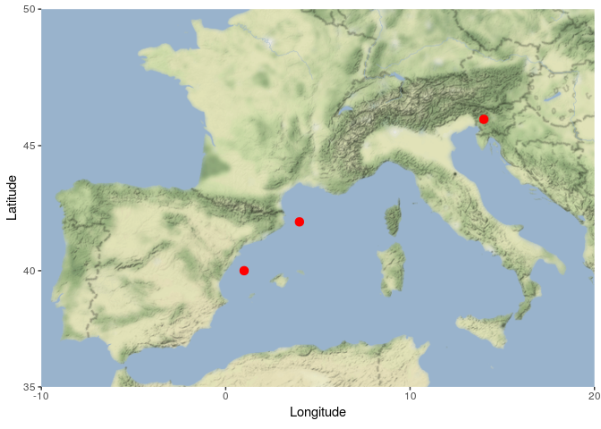
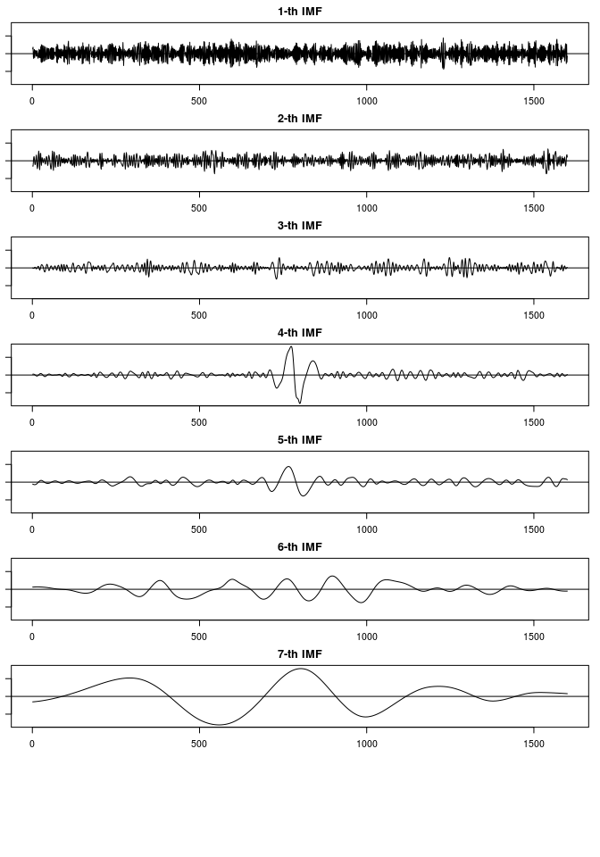
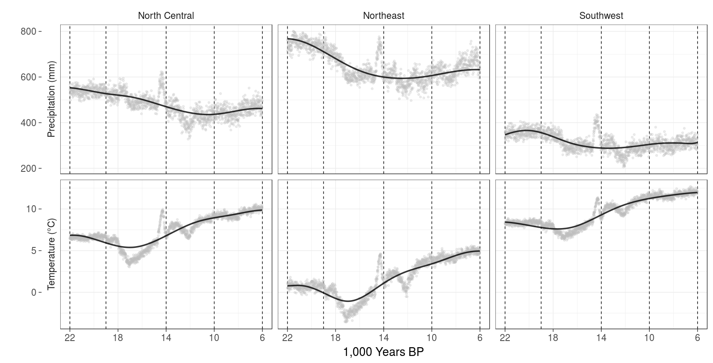
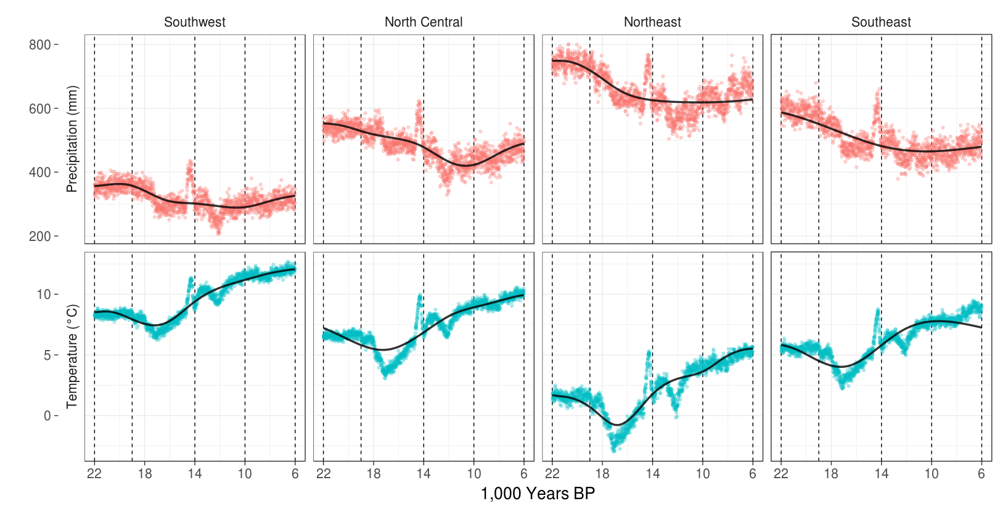
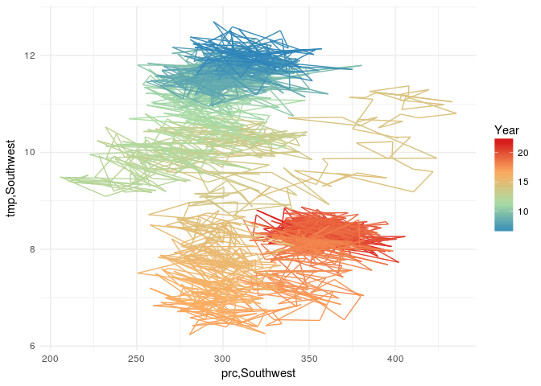
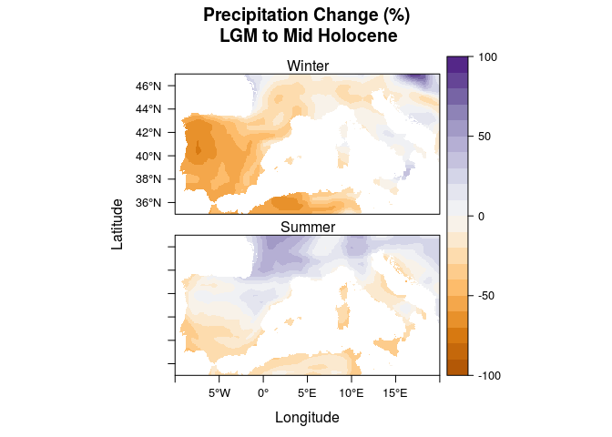

# West Mediterranean during the Last Deglaciation
Nick Gauthier  
`r Sys.Date()`  


# Introduction

We'll be comparing paleoclimate model estimates of temperature and precipitation over three points in the west Mediterranean to global paleoclimate proxies.

## Setup
Load all the packages we'll need for this analysis. 

<label for="tufte-mn-" class="margin-toggle">&#8853;</label><input type="checkbox" id="tufte-mn-" class="margin-toggle"><span class="marginnote">You'll need to have the netCDF libraries already installed on your system for ncdf4 to work.</span>

```r
library(ncdf4) # import GCM data
library(raster) # process GCM data
library(tidyverse) # data management and plotting
library(magrittr) # pipes for code readability
library(EMD) # calculate trends in the data
```


# Climate Model

## Sample Locations
<p><span class="marginnote shownote"><!--
<div class="figure">-->

<!--
<p class="caption marginnote">-->Locations of 3 sample points.<!--</p>-->
<!--</div>--></span></p>

Create a matrix with the coordinates for the three locations of interest in the west Mediterranean. We'll be focusing on large grid cell averages, so the points do not have to be directly over land.

```r
samp.pts <- matrix(c(1,40, 4,42, 14,46), ncol = 2, byrow = T)
samp.pts
```

```
##      [,1] [,2]
## [1,]    1   40
## [2,]    4   42
## [3,]   14   46
```

## TraCE-21k

<p><span class="marginnote shownote"><!--
<div class="figure">-->

<!--
<p class="caption marginnote">-->TraCE21-k global precipitation and temperature<!--</p>-->
<!--</div>--></span></p>

First, import data from the TraCE-21k paleoclimate simulation. Then extract temperature and precipitation values at three locations in the west Mediterranean. Use the *brick* function from **raster** to import decadal averages from the simulation. Put the coordinates for the three locations in a matrix, and use that matrix to and **raster's** *extract* function to get the values from the climate model brick. Convert the precipitation values to mm/year and temperature values to degrees Celsius. Finally, name the columns for each region appropriately. 

Now pull all the TraCE data into one data frame, with one row per year, and one column per variable/location combination. First *rbind* the two sets of TraCE data and *transpose* the results, turning the 6 rows into 6 columns. Add a column for the Year (in ka BP), and use to select only the entries earlier than 6,000 BP.


```r
trace.dat <- rbind(
  brick('trace.01-36.22000BP.cam2.PRECT.22000BP_decavg_400BCE.nc') %>%
    raster::extract(samp.pts) %>% # extract data at these coordinates
    multiply_by(3.154e+10), # convert to mm/year
  brick('trace.01-36.22000BP.cam2.TREFHT.22000BP_decavg_400BCE.nc') %>%
    raster::extract(samp.pts) %>% 
    subtract(273.15)) %>% # convert from kelvin to C
  t %>% # transpose
  as.data.frame %>%
  set_colnames(c('tmp,Southwest', 'tmp,North Central', 'tmp,Northeast', 
                 'prc,Southwest', 'prc,North Central', 'prc,Northeast')) %>%
  rownames_to_column('Year') %>%
  mutate(Year = as.numeric(substring(Year, 3))) %>%
  filter(Year > 6) # get all the decades up to 6ka BP
```


## Trend Analysis

Let's use the **EMD** package to calculate actual trend lines using the empirical mode decomposition approach.
<p><span class="marginnote shownote"><!--
<div class="figure">-->

<!--
<p class="caption marginnote">-->Empirical mode decomposition<!--</p>-->
<!--</div>--></span></p>

Now organize the temperature and precipitation data to make plotting easier using functions from **tidyr**.
<label for="tufte-mn-" class="margin-toggle">&#8853;</label><input type="checkbox" id="tufte-mn-" class="margin-toggle"><span class="marginnote">Replace the variable names to make facet naming easier too.</span>

```r
trace.plot <- trace.dat %>% 
  gather(key, value, - Year) %>%
  separate(key, c('Variable', 'Region'), ',') %>%
  mutate(Variable = ifelse(
    Variable == 'tmp', 'Temperature (°C)', 'Precipitation (mm)'))

emd.res <- function(x) emd(x)$residue
trace.emd <- trace.dat %>%
  mutate_at(vars(-Year), emd.res) %>%
  gather(key, value, - Year) %>%
  separate(key, c('Variable', 'Region'), ',') %>%
  mutate(Variable = ifelse(
    Variable == 'tmp', 'Temperature (°C)', 'Precipitation (mm)'))
```

Plot everything with **ggplot2**.
<p><span class="marginnote shownote"><!--
<div class="figure">-->

<!--
<p class="caption marginnote">-->Black and white version<!--</p>-->
<!--</div>--></span></p>


```r
ggplot(data = trace.plot, aes(x = Year, y = value)) +
  facet_grid(Variable ~ Region, switch = 'y', scale = 'free_y') +
  geom_vline(xintercept = c(22, 19, 14, 10, 6), lty = 2) +
  geom_point(aes(color = Variable), alpha = .3) +
  geom_line(data = trace.emd, size = 1.2, color = "black", alpha = .8) +
  scale_x_reverse(breaks = seq(6,22,4)) +
  labs(x = '1,000 Years BP', y = '') +
  guides(color = "none") +
  theme_bw(base_size = 20) +
  theme(strip.background  = element_blank())
```

<div class="figure fullwidth">

<p class="caption marginnote shownote"> </p>
</div>


# Proxy records

Get ice core data.

```r
core.dat <- read_csv('icecores_newdates.csv') %>%
  transmute(years.BP, ngrip =  d18O.NGRIP2.ppt, gisp = d18O.GISP2.ppt) %>%
  filter(years.BP < 24000 & years.BP >=6000)
```

```
## Warning: Missing column names filled in: 'X1' [1]
```
Plot it

```r
core.plot <- gather(core.dat, 'core', 'd18O', 2:3)

ggplot(core.plot, aes(x = years.BP, y = d18O, color = core)) +
  geom_line(alpha = .54) +
  geom_smooth() +
  scale_x_reverse(breaks = seq(6000,22000,4000)) +
  theme_minimal()
```

```
## `geom_smooth()` using method = 'gam'
```

```
## Warning: Removed 367 rows containing non-finite values (stat_smooth).
```

```
## Warning: Removed 348 rows containing missing values (geom_path).
```



## Detrending

```r
cores <- core.dat %>% na.omit
core.emd.plot <- emd(cores$gisp, cores$years.BP)$residue %>% 
  data_frame(d18O = ., years.BP = cores$years.BP)
```


```r
ggplot(core.plot, aes(x = years.BP, y = d18O)) +
  geom_line(aes(color = core), alpha = .54) +
  geom_line(data = core.emd.plot) +
  scale_x_reverse(breaks = seq(6000,22000,4000)) +
  theme_minimal()
```

```
## Warning: Removed 348 rows containing missing values (geom_path).
```


