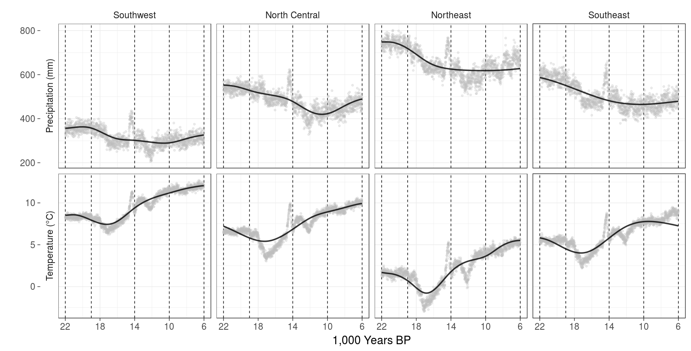
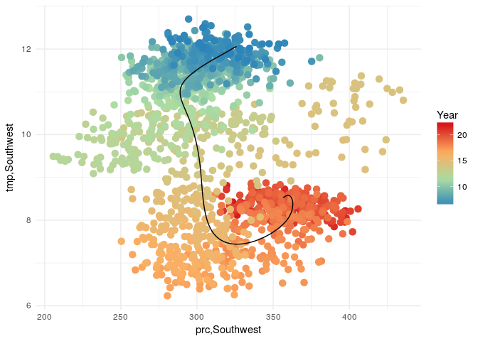
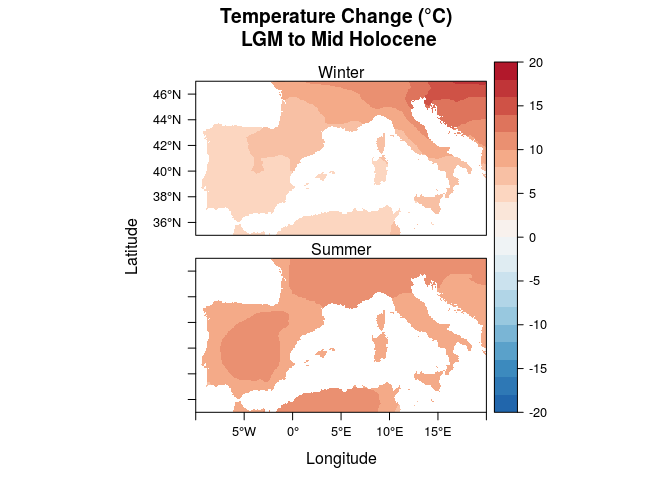
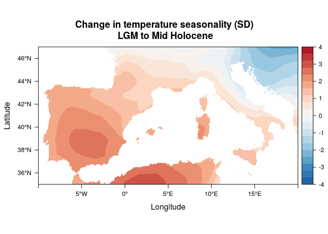
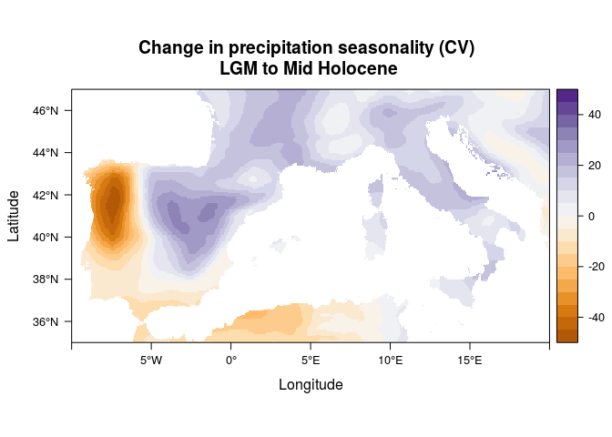
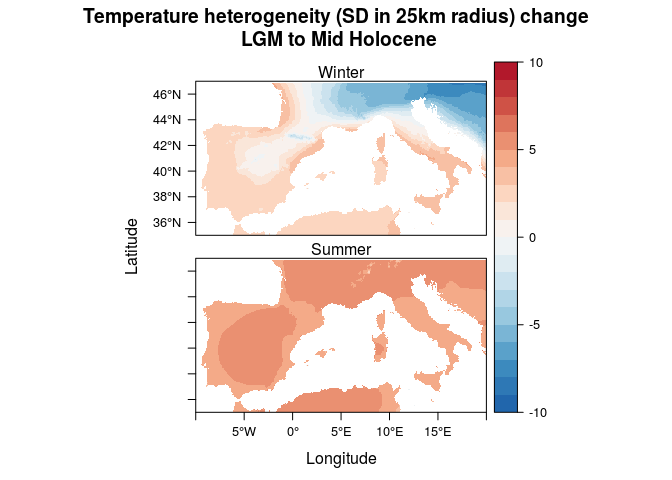
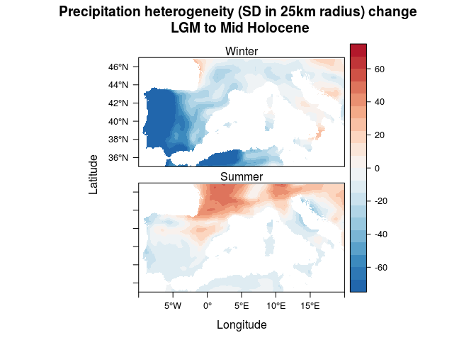
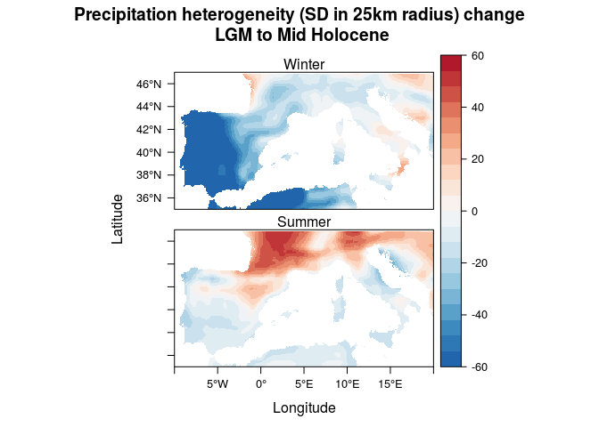
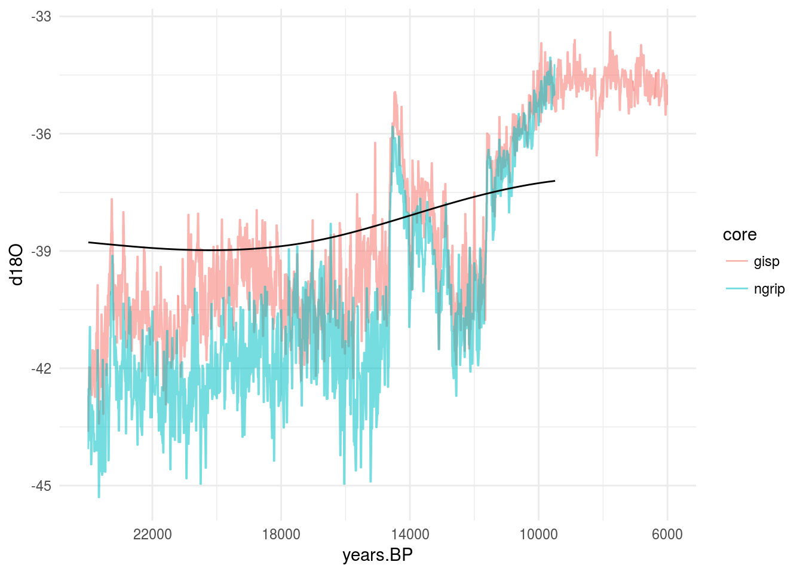

# West Mediterranean during the Last Deglaciation
Nick Gauthier  
`r Sys.Date()`  


# Introduction

We'll be comparing paleoclimate model estimates of temperature and precipitation over three points in the west Mediterranean to global paleoclimate proxies.

## Setup
Load all the packages we'll need for this analysis. 

<label for="tufte-mn-" class="margin-toggle">&#8853;</label><input type="checkbox" id="tufte-mn-" class="margin-toggle"><span class="marginnote">You'll need to have the netCDF libraries already installed on your system for ncdf4 to work.</span>

```r
library(ncdf4) # import GCM data
library(rgdal) # read GCM data
library(raster) # process GCM data
library(rasterVis) # plotting GCM data
library(tidyverse) # data management and plotting
library(magrittr) # pipes for code readability
library(EMD) # calculate trends in the data
```


# Climate Model

## Sample Locations
<p><span class="marginnote shownote"><!--
<div class="figure">-->

<!--
<p class="caption marginnote">-->Locations of 3 sample points.<!--</p>-->
<!--</div>--></span></p>

Create a matrix with the coordinates for the three locations of interest in the west Mediterranean.

```r
samp.pts <- matrix(c(0, 40, 4, 44, 12, 46, 14, 43), 
                   ncol = 2, byrow = T)

#12,43
```

## TraCE-21k

<p><span class="marginnote shownote"><!--
<div class="figure">-->

<!--
<p class="caption marginnote">-->TraCE21-k global precipitation and temperature<!--</p>-->
<!--</div>--></span></p>

First, import data from the TraCE-21k paleoclimate simulation. Then extract temperature and precipitation values at three locations in the west Mediterranean. Use the *brick* function from **raster** to import decadal averages from the simulation. Put the coordinates for the three locations in a matrix, and use that matrix to and **raster's** *extract* function to get the values from the climate model brick. Convert the precipitation values to mm/year and temperature values to degrees Celsius. Finally, name the columns for each region appropriately. 

Now pull all the TraCE data into one data frame, with one row per year, and one column per variable/location combination. First *rbind* the two sets of TraCE data and *transpose* the results, turning the 6 rows into 6 columns. Add a column for the Year (in ka BP), and use to select only the entries earlier than 6,000 BP.


```r
trace.dat <- rbind(
  brick('trace.01-36.22000BP.cam2.TREFHT.22000BP_decavg_400BCE.nc') %>%
    raster::extract(samp.pts) %>% 
    subtract(273.15), # convert from kelvin to C
  brick('trace.01-36.22000BP.cam2.PRECT.22000BP_decavg_400BCE.nc') %>%
    raster::extract(samp.pts) %>% # extract data at these coordinates
    multiply_by(3.154e+10)) %>% # convert to mm/year
  t %>% # transpose
  as.data.frame %>%
  set_colnames(c('tmp,Southwest', 'tmp,North Central', 'tmp,Northeast', 'tmp,Southeast',
                 'prc,Southwest', 'prc,North Central', 'prc,Northeast', 'prc,Southeast')) %>%
  rownames_to_column('Year') %>%
  mutate(Year = as.numeric(substring(Year, 3))) %>%
  filter(Year > 6) # get all the decades up to 6ka BP
```


## Trend Analysis

Let's use the **EMD** package to calculate actual trend lines using the empirical mode decomposition approach.
<p><span class="marginnote shownote"><!--
<div class="figure">-->

<!--
<p class="caption marginnote">-->Empirical mode decomposition<!--</p>-->
<!--</div>--></span></p>

Now organize the temperature and precipitation data to make plotting easier using functions from **tidyr**.
<label for="tufte-mn-" class="margin-toggle">&#8853;</label><input type="checkbox" id="tufte-mn-" class="margin-toggle"><span class="marginnote">Replace the variable names to make facet naming easier too.</span>

```r
trace.plot <- trace.dat %>% 
  gather(key, value, - Year) %>%
  separate(key, c('Variable', 'Region'), ',') %>%
  mutate(Region = factor(Region, levels = c('Southwest', 'North Central', 'Northeast', 'Southeast')),    # turn region into factor so it is ordered correctly
         Variable = ifelse(
    Variable == 'tmp', 'Temperature (°C)', 'Precipitation (mm)'))

emd.res <- function(x) emd(x, boundary = 'wave')$residue
trace.emd <- trace.dat %>%
  mutate_at(vars(-Year), emd.res) %>%
  gather(key, value, - Year) %>%
  separate(key, c('Variable', 'Region'), ',') %>%
  mutate(Region = factor(Region, levels = c('Southwest', 'North Central', 'Northeast', 'Southeast')),
         Variable = ifelse(
    Variable == 'tmp', 'Temperature (°C)', 'Precipitation (mm)'))

#trace.plot %>% mutate(Raw = value, Trend = trace.emd[,4], value = NULL) %>% write_csv('~/Downloads/trace_plot_data.csv')
```

## Plotting
Plot everything with **ggplot2**.
<p><span class="marginnote shownote"><!--
<div class="figure">-->

<!--
<p class="caption marginnote">-->Black and white version<!--</p>-->
<!--</div>--></span></p>


```r
ggplot(data = trace.plot, aes(x = Year, y = value)) +
  facet_grid(Variable ~ Region, switch = 'y', scale = 'free_y') +
  geom_vline(xintercept = c(22, 19, 14, 10, 6), lty = 2) +
  geom_point(aes(color = Variable), alpha = .3) +
  geom_line(data = trace.emd, size = 1.2, color = "black", alpha = .8) +
  scale_x_reverse(breaks = seq(6,22,4)) +
  labs(x = '1,000 Years BP', y = '') +
  guides(color = "none") +
  theme_bw(base_size = 20) +
  theme(strip.background  = element_blank())
```

<div class="figure fullwidth">

<p class="caption marginnote shownote"> </p>
</div>

Calculate the detrended variances.

```r
emd.dat <- trace.dat %>%
  mutate_at(vars(-Year), emd.res)

(trace.dat - emd.dat) %>%
  select(-Year) %>%
  cbind(Year = trace.dat$Year, .) %>%
  mutate(Period = cut(Year, c(22, 19, 14, 10, 6))) %>%
  group_by(Period) %>%
  summarise_each(funs(var)) %>%
  select(-Year) %>%
    print(width = Inf)
```

```
## # A tibble: 4 × 9
##    Period `tmp,Southwest` `tmp,North Central` `tmp,Northeast`
##    <fctr>           <dbl>               <dbl>           <dbl>
## 1  (6,10]      0.08704209           0.0922012       0.1853124
## 2 (10,14]      0.27096878           0.3907428       0.8121861
## 3 (14,19]      0.40989953           1.4185010       1.3565404
## 4 (19,22]      0.10400222           0.2620887       0.2029233
##   `tmp,Southeast` `prc,Southwest` `prc,North Central` `prc,Northeast`
##             <dbl>           <dbl>               <dbl>           <dbl>
## 1       0.4481085        488.1919            778.4795       1230.0957
## 2       0.3543841        772.4411           1015.4651       1191.1768
## 3       0.9364233       1317.6964           1308.8443       1567.4188
## 4       0.2716865        313.4281            391.5337        531.6333
##   `prc,Southeast`
##             <dbl>
## 1        739.1441
## 2        936.9639
## 3       2021.5821
## 4        649.1395
```

How do these compare to the overall regional variance?

```r
bbox <- extent(c(-10, 20, 35, 47))

trace.reg.avg <- rbind(
  brick('trace.01-36.22000BP.cam2.TREFHT.22000BP_decavg_400BCE.nc') %>%
    raster::extract(bbox, fun = mean) %>% 
    subtract(273.15), # convert from kelvin to C
  brick('trace.01-36.22000BP.cam2.PRECT.22000BP_decavg_400BCE.nc') %>%
    raster::extract(bbox, fun = mean) %>%
    multiply_by(3.154e+10)) %>% # convert to mm/year
  t %>% # transpose
  as.data.frame %>%
  set_colnames(c('tmp,StudyArea', 'prc,StudyArea')) %>%
  rownames_to_column('Year') %>%
  mutate(Year = as.numeric(substring(Year, 3))) %>%
  filter(Year > 6) 

emd.reg.avg <- trace.reg.avg %>%
  mutate_at(vars(-Year), emd.res)

(trace.dat - emd.dat) %>%
  select(-Year) %>%
  cbind(Year = trace.dat$Year, .) %>%
  mutate(Period = cut(Year, c(22, 19, 14, 10, 6))) %>%
  group_by(Period) %>%
  summarise_each(funs(var)) %>%
  select(-Year) %>%
  subtract(((trace.reg.avg - emd.reg.avg) %>%
  magrittr::extract(c(2,2,2,2,3,3,3,3)) %>%
  cbind(Year = trace.dat$Year, .) %>%
  mutate(Period = cut(Year, c(22, 19, 14, 10, 6))) %>%
  group_by(Period) %>%
  summarise_each(funs(var)) %>%
  select(-Year))) %>%
    print(width = Inf)
```

```
## Warning in Ops.factor(left, right): '-' not meaningful for factors
```

```
##   Period tmp,Southwest tmp,North Central tmp,Northeast tmp,Southeast
## 1     NA   -0.03803870       -0.03287960    0.06023160    0.32302766
## 2     NA   -0.16399338       -0.04421932    0.37722393   -0.08057806
## 3     NA   -0.58309403        0.42550744    0.36354680   -0.05657024
## 4     NA   -0.06821138        0.08987510    0.03070968    0.09947292
##   prc,Southwest prc,North Central prc,Northeast prc,Southeast
## 1      127.1965          417.4842      869.1004      378.1488
## 2      288.8544          531.8784      707.5902      453.3773
## 3      109.8887          101.0366      359.6112      813.7744
## 4      102.7977          180.9033      321.0029      438.5091
```


## Climate trajectories


```r
myPalette <- colorRampPalette(rev(brewer.pal(4, "Spectral")))
ggplot(trace.dat, aes(x = `prc,Southwest`, y =`tmp,Southwest`, color = Year)) +
  geom_path(linejoin = 'round') + 
  scale_color_gradientn(colors = myPalette(100)) +
  theme_minimal()
```


```r
ggplot(trace.dat, aes(x = `prc,Southwest`, y =`tmp,Southwest`, color = Year)) +
  geom_point(size = 3) + 
  geom_path(data = emd.dat, color = 'black') + 
  scale_color_gradientn(colors = myPalette(100)) +
  theme_minimal()
```




## Spatial patterns

Now let's import previously-downscaled ensemble equilibrium simulations of the Last Glacial Maximum and Mid Holocene, to estimate how the spatial patterns of climate variability have changed over time, and to test for consistency with the transient TraCE simulation.

First import the downscaled data.

```r
bbox <- extent(c(-10, 20, 35, 47))

lgm.prc <- brick('Downscaled/ensemble_prc_lgm.tif') %>%
  crop(bbox)
mh.prc <- brick('Downscaled/ensemble_prc_mh6k.tif') %>%
  crop(bbox)

lgm.tmp <- brick('Downscaled/ensemble_tmn_lgm.tif') %>%
  crop(bbox) %>%
  add(brick('Downscaled/ensemble_tmx_lgm.tif') %>% crop(bbox)) %>%
  divide_by(2)
mh.tmp <- brick('Downscaled/ensemble_tmn_mh6k.tif') %>%
  crop(bbox) %>%
  add(brick('Downscaled/ensemble_tmx_mh6k.tif') %>% crop(bbox)) %>%
  divide_by(2)
```


Calculate changes in seasonal precipitation and temperature.

```r
bySeason <- function(x, season, var){
  if(season == 'djf') {ids <- c(1,2,12)}
  if(season == 'jja') {ids <- c(6,7,8)}
  
  if(var == 'tmp') return(mean(x[[ids]]))
  if(var == 'prc') return(sum(x[[ids]]))
}

prc.change.map <- brick(c(
  bySeason(mh.prc, 'djf', 'prc') - bySeason(lgm.prc, 'djf', 'prc'),
  bySeason(mh.prc, 'jja', 'prc') - bySeason(lgm.prc, 'jja', 'prc')))
prc.change.map[prc.change.map < -200] <- -200 # so the plot isn't washed out by large precip values


prc.change.map.percent <- brick(c(
  (bySeason(mh.prc, 'djf', 'prc') - bySeason(lgm.prc, 'djf', 'prc')) * 100 / bySeason(lgm.prc, 'djf', 'prc'), 
  (bySeason(mh.prc, 'jja', 'prc') - bySeason(lgm.prc, 'jja', 'prc')) * 100 / bySeason(lgm.prc, 'jja', 'prc')))

tmp.change.map <- brick(c(
  bySeason(mh.tmp, 'djf', 'tmp') - bySeason(lgm.tmp, 'djf', 'tmp'),
  bySeason(mh.tmp, 'jja', 'tmp') - bySeason(lgm.tmp, 'jja', 'tmp')))
```

Plot the results

```r
levelplot(prc.change.map.percent, margin = F, names.attr = c('Winter', 'Summer'),
          main = 'Precipitation Change (%)\n LGM to Mid Holocene',
          par.settings = PuOrTheme(), 
          at = seq(-100,100,10))
```


```r
# note in the next plot all values less than -200 have been turned into -200
levelplot(prc.change.map, margin = F, names.attr = c('Winter', 'Summer'), 
          main = 'Precipitation Change (mm) \n LGM to Mid Holocene',
          par.settings = PuOrTheme(), 
          at = seq(-200,200,20))    
```


```r
levelplot(tmp.change.map, margin = F, names.attr = c('Winter', 'Summer'), 
          main = 'Temperature Change (°C)\n LGM to Mid Holocene',
          par.settings = BuRdTheme(),
          at = seq(-20,20,2))
```



Now we can calculate changes in seasonality. For temperature, this is just the standard deviation of all 12 monthly averages. For precipitation, we will use the coefficient of variation.

```r
tmp.seasonality <- calc(mh.tmp, sd) - calc(lgm.tmp, sd)
prc.seasonality <- cv(mh.prc) - cv(lgm.prc)
```
Plot the results.

```r
levelplot(tmp.seasonality, margin = F, 
          main = 'Change in temperature seasonality (SD)\n LGM to Mid Holocene', 
          par.settings = BuRdTheme(), 
          at = seq(-4, 4, .4))
```



```r
levelplot(prc.seasonality, margin = F, 
          main = 'Change in precipitation seasonality (CV)\n LGM to Mid Holocene', 
          par.settings = PuOrTheme(), 
          at = seq(-50, 50, 5))
```



What about changes in spatial hetergeneity?

```r
wts <- matrix(c(0,0,1,0,0,0,1,1,1,0,1,1,1,1,1,0,1,1,1,0,0,0,1,0,0), nrow = 5)

tmp.hetero <- brick(c(
  bySeason(mh.tmp, 'djf', 'tmp') %>%
    focal(w = wts, sd, na.rm = T) %>%
    subtract(
      bySeason(lgm.tmp, 'djf', 'tmp') %>% 
        focal(w = wts, sd, na.rm = T)),
  bySeason(mh.tmp, 'jja', 'tmp') %>%
    focal(w = wts, sd, na.rm = T) %>%
    subtract(
      bySeason(lgm.tmp, 'jja', 'tmp') %>% 
        focal(w = wts, sd, na.rm = T)))) %>%
  mask(mh.tmp[[1]]) # clip buffer added by window
  
levelplot(tmp.hetero, margin = F, names.attr = c('Winter', 'Summer'), 
          main = 'Temperature heterogeneity (SD in 25km radius) change\n LGM to Mid Holocene',
          par.settings = BuRdTheme(), at = seq(-10, 10, 1))
```


Same for precipitaiton.


```r
prc.hetero.sd <- brick(c(
  bySeason(mh.prc, 'djf', 'prc') %>%
    focal(w = wts, sd, na.rm = T) %>%
    subtract(
      bySeason(lgm.prc, 'djf', 'prc') %>% 
        focal(w = wts, sd, na.rm = T)),
  bySeason(mh.prc, 'jja', 'prc') %>%
    focal(w = wts, sd, na.rm = T) %>%
    subtract(
      bySeason(lgm.prc, 'jja', 'prc') %>% 
        focal(w = wts, sd, na.rm = T)))) %>%
  mask(mh.prc[[1]]) # clip buffer added by window

#levelplot(prc.hetero.sd, margin = F, names.attr = c('Winter', 'Summer'), 
#          main = 'Precipitation heterogeneity (SD in 25km radius) change\n LGM to Mid Holocene',
#          par.settings = BuRdTheme(), at = seq(-500, 500, 50))

#capped at -75
prc.hetero.sd[prc.hetero.sd < -75] <- -75
levelplot(prc.hetero.sd, margin = F, names.attr = c('Winter', 'Summer'), 
          main = 'Precipitation heterogeneity (SD in 25km radius) change\n LGM to Mid Holocene',
          par.settings = BuRdTheme(), at = seq(-75, 75, 7.5))
```



```r
# capped at -60
prc.hetero.sd[prc.hetero.sd < -60] <- -60
levelplot(prc.hetero.sd, margin = F, names.attr = c('Winter', 'Summer'), 
          main = 'Precipitation heterogeneity (SD in 25km radius) change\n LGM to Mid Holocene',
          par.settings = BuRdTheme(), at = seq(-60, 60, 6))
```




```r
## now cv

prc.hetero.cv <- brick(c(
  bySeason(mh.prc, 'djf', 'prc') %>%
    focal(w = wts, cv, na.rm = T) %>%
    subtract(
      bySeason(lgm.prc, 'djf', 'prc') %>% 
        focal(w = wts, cv, na.rm = T)),
  bySeason(mh.prc, 'jja', 'prc') %>%
    focal(w = wts, cv, na.rm = T) %>%
    subtract(
      bySeason(lgm.prc, 'jja', 'prc') %>% 
        focal(w = wts, cv, na.rm = T)))) %>%
  mask(mh.prc[[1]]) # clip buffer added by window
  
#levelplot(prc.hetero.cv, margin = F, names.attr = c('Winter', 'Summer'), 
#          main = 'Precipitation heterogeneity (CV in 25km radius) change\n LGM to Mid Holocene',
#          par.settings = BuRdTheme(), at = seq(-2.2, 2.2, .22))

# now cap at +/- .25

prc.hetero.cv[prc.hetero.cv > .25] <- .25
prc.hetero.cv[prc.hetero.cv < -.25] <- -.25
levelplot(prc.hetero.cv, margin = F, names.attr = c('Winter', 'Summer'), 
          main = 'Precipitation heterogeneity (CV in 25km radius) change\n LGM to Mid Holocene',
          par.settings = BuRdTheme(), at = seq(-.25, .25, .025))
```



<label for="tufte-mn-" class="margin-toggle">&#8853;</label><input type="checkbox" id="tufte-mn-" class="margin-toggle"><span class="marginnote">Compare these with raw gcm outputs to check the added value of SDM</span>


